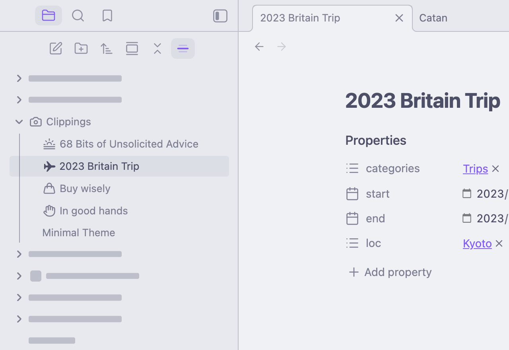
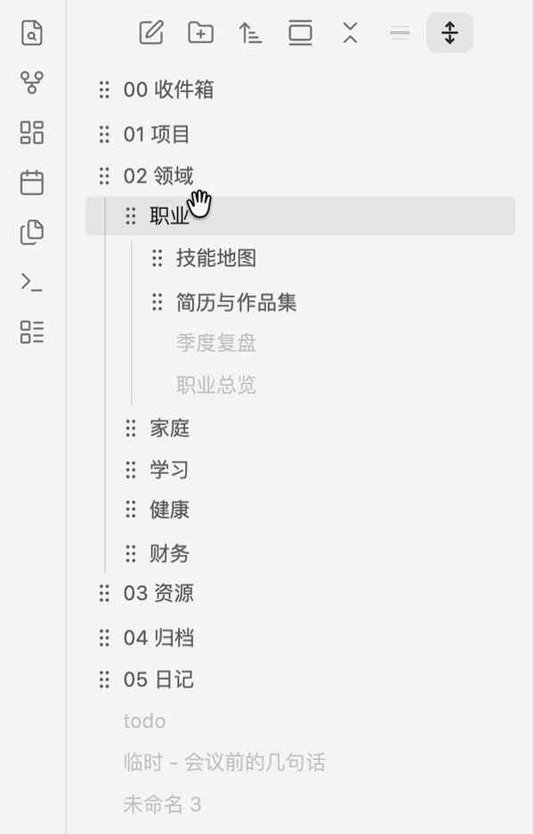

# Immersive Folder

[English](README.md) · 简体中文

一个 Obsidian 插件。当你在某个文件夹里工作时，这个文件夹保持可读，文件列表中的
其他内容全部退到骨架条后面。



聚焦哪个文件夹是根据你当前打开的文件自动判断的 —— 不用手动选，也不用记得在换
地方时关掉。在别处打开一篇笔记，骨架条就跟着你过去。什么都没打开的时候，没有可以
沉浸进去的文件夹，按钮会变暗并提示你先打开一篇笔记，而不是存下一个它画不出来的
模式。

保持可读的只有这个文件夹和它装着的东西。它**上层**的那些文件夹同样会变成骨架条：
最顶层的名字往往是屏幕上最能说明问题的那一个，把这条路径留着可读，等于把遮挡本来
要盖住的东西原样交了出去。缩进没有被动过，所以你依然看得出自己在哪一层。

自定义图标（来自 [Iconize](https://github.com/FlorianWoelki/obsidian-iconize)）
会变成占位方块而不是消失，这样每一行的形状都还在，被遮住的列表读起来仍然像个
列表。

你还可以**手动排列文件夹**：打开「调整文件夹顺序」模式，拖动文件夹来决定它们的
先后。文件不参与，它们始终待在排序菜单给的位置上。除了顺序本身，不会往磁盘上写
任何东西 —— 文件一个都不会被移动，平时的拖拽也原样保留。

## 为什么要有它

- **专注。** 两千篇笔记的库，不再和你手头真正在处理的那十几篇抢注意力。
- **防旁人瞥屏。** 在办公室打开工作文件夹，旁边的同事看到的是这个文件夹，而不是
  你库里其他所有东西的名字。
- **录屏分享。** 只展示视频要讲的那个文件夹，侧边栏其余部分保持不可读，不用为了
  录一段视频先去重新整理你的库。

## 怎么用

- **文件列表顶部的按钮**，点一下开关。遮挡开启时它会染上你的主题强调色，一眼
  就能看出当前状态。
- **命令面板里的 `Immersive Folder: Toggle immersive folder`**，同样的作用，可以
  绑快捷键 —— 如果你经常在录屏前后开关，值得绑一个。

开关状态会在重启后保留。

### 手动排列文件夹

文件列表顶部那个**上下箭头按钮**打开「调整文件夹顺序」模式。每个文件夹都会长出
手柄并轻轻浮动 —— 这是列表在告诉你它现在可以重排了。上下拖动一个文件夹决定它排在
同级文件夹中间的哪个位置，再点一次按钮退出。



**只有文件夹参与。** 文件不会长出手柄、不会浮动，模式开着时还会变暗 —— 它们始终
待在 Obsidian 排序菜单给的位置上，所以按文件名或按时间排序照样是原来的效果。
插件负责这棵树的骨架，排序菜单负责骨架里的每一行。

**按住某个文件夹时，只有能接住它的同级文件夹继续浮动**，其他层级的会变暗、停下。
调顺序永远是同级之间的事，这样你能一眼看见，而不必去记。一条线会显示它将落在哪里。

改动是随手保存的，按钮只管进出。

某个文件夹第一次被拖过之后，它里面子文件夹的顺序就固定下来。其余文件夹仍按你在
Obsidian 里选的方式排序；一个你从没排过的库，什么都不会存。之后新建的文件夹会
先排在末尾，直到你把它拖走。

模式开着时整棵树是静止的：点行不会打开笔记，文件夹也不会折叠，手柄就坐在原来
折叠箭头的位置。要展开什么，进模式之前先展开。

**平时的拖拽完全没变。** 关掉这个模式，把笔记拖进另一个文件夹和以前一模一样 ——
那是 Obsidian 自己的功能，本插件根本不监听。把两件事在时间上分开，才让每一次
拖拽都不含糊：在屏幕上，「排到那个文件夹下面」和「放进那个文件夹里」是同一个像素。

**沉浸模式和调整顺序模式轮流使用。** 遮挡盖住的正是你要用来排序的那些名字，所以
在一个开着的时候去开另一个，它会告诉你先关掉谁，而不是悄悄替你关掉。正在等待的
那个按钮会变暗，鼠标停上去会说明原因。

### 设置项

**Language（语言）** —— 界面默认跟随 Obsidian 自己的语言设置。插件自带英文和
简体中文，也可以在这里手动指定。切换即时生效，命令名也会跟着变。

**Toolbar buttons（工具栏按钮）** —— 本插件的两个按钮里，哪些留在文件列表顶部。
它们都是能看出模式开没开的开关，所以默认都摆在明面上；如果你只用其中一个功能，
可以把另一个藏起来。藏起来的那个，命令面板里照样能用；藏了东西之后，设置页会多出
一行，点一下直接带你去快捷键页面。

**Keep the active file in view（让当前文件始终可见）** —— 每次切换笔记时，滚动
文件列表到那篇笔记，并展开必要的层级把它露出来。没有这个的话，切到一篇所在文件夹
恰好在视野之外的笔记，你会看到满屏骨架条、别的什么都没有。默认开启。

**Collapse every other folder（收起其他所有文件夹）** —— 每次切换时，把除当前
文件夹之外的所有文件夹都收起来。需要滚动的内容更少，也让骨架条不再暴露其他文件夹
里装了多少东西。退出沉浸模式时，原先展开的文件夹会照原样恢复。默认开启。

### 改变它画出来的东西

插件画的每样东西都取自 CSS 变量，写个 snippet 就能让它贴合你的主题：

```css
body {
  /* 骨架条 */
  --immersive-folder-bar: var(--text-faint);
  --immersive-folder-bar-opacity: 0.5;

  /* 调整顺序模式：落点线、你按住的那一行、手柄，以及其他层级变暗的程度 */
  --immersive-folder-drop-line: var(--color-accent);
  --immersive-folder-drag-bg: var(--background-modifier-active-hover);
  --immersive-folder-handle: var(--text-muted);
  --immersive-folder-dim: 0.32;
}
```

落点线跟随你在「外观 → 强调色」里选的那个颜色，所以不用特意设置，它自己就会
跟上你当前的主题。

## 它做不到什么

**这是视觉遮挡，不是加密。** 那些名字仍然在页面里 —— 任何人打开开发者工具都能
读到。它是为镜头、投影仪和你旁边那张桌子准备的，不是为了防住一个已经能操作你
电脑的人。

如果关掉 **Collapse every other folder**，骨架条仍然会暴露每个文件夹里**有多少
个**文件，以及**树有多深** —— 因为每一行都原样留在那里。保持这个选项开启就能把
这些一并折叠掉，剩下的只是每个非当前文件夹一根条。如果你希望那些行干脆消失，那么像
[Explorer Focus](https://github.com/davidvkimball/obsidian-explorer-focus) 这类
隐藏式插件会直接把它们移除掉。

遮挡只作用于文件列表。标签页标题、笔记自己的面包屑、搜索结果和快速切换器都不受
影响 —— 包括文件列表自带的搜索过滤框打开时，搜索结果和其他内容一样会被骨架化。
想按名字搜索，先把遮挡关掉。

## 实现原理

遮挡靠行上的 `data-path` 属性匹配，给该保留的行打上一个 class，再由一张静态样式表
接手。这么做有两个原因：文件列表是虚拟滚动的，一行随时可能被创建出来，必须一出
现就已经带好样式；以及，你所在的文件夹即使处于折叠状态、当前文件那一行根本不在
文档里，它的名字也依然正常显示。

如果没有打开任何文件，遮挡会自行撤下，而不是继续遮住一切 —— 所以你永远不会被困
在一列读不出名字的骨架条里。

折叠和滚动走的是文件列表自己的行映射表，属于内部 API：每一处使用都做了防御性检查，
所以即便将来 Obsidian 改了名字，也只是这两个选项失效，遮挡本身照常工作。折叠只在
当前文件真正发生变化时执行，而不是每次重绘都跑，否则你每挪动一次面板它都会和你抢。

自定义顺序是盖在 Obsidian 自身排序之上的一次重新洗牌，而不是替代品。插件在文件
列表的原型上改写了 `getSortedFolderItems`，没有顺序记录的文件夹会被原样交还 ——
所以除了你手动排过的那些子文件夹，排序菜单仍然决定一切。被挪动的只有文件夹行，
而且是在它们本来占据的下标之间挪，所以每个文件都还在 Obsidian 放的位置上。
顺序按文件夹存成一串子文件夹名字，且只有你真的拖过的文件夹才会被记录。

让「调整顺序」和「移动文件」互不打架的，正是这个模式。模式关着时，这里根本不监听
任何拖拽；模式开着时，文件列表上的每一个拖拽事件都在捕获阶段被接下，早于 Obsidian
自己的处理器 —— 这不是为了整洁，而是全部的安全性所在：放任不管的话，Obsidian 会
展开指针停留的文件夹，并把文件移进它最后看到的那个文件夹里，包括那些根本没画出
落点线的位置，于是这次移动到来时，屏幕上没有任何东西预告过它。行本身的
`draggable` 来自 Obsidian，所以这里不需要自己发起拖拽。

那处原型改写以及随后的重绘用的都是内部 API，使用前都做了检查，卸载时会撤销；
如果将来的 Obsidian 挪走了它们，排序功能会自行关闭，其余部分照常工作。

## 安装

还没有上架社区插件市场。从 [最新
release](https://github.com/iBlinkQ/immersive-folder/releases/latest) 下载
`main.js`、`manifest.json` 和 `styles.css`，放进
`你的库/.obsidian/plugins/immersive-folder/`，然后在 设置 → 第三方插件 里启用。

（`main.js` 是构建产物，不保存在仓库里 —— 它只存在于 release 中，或者你自己跑
`npm run build` 之后。）

## 开发

```bash
npm install
npm run dev     # 监听构建
npm run build   # 类型检查并构建 main.js
npm run sync    # 构建后复制进 sync.mjs 里列出的库
```

## 许可

MIT
